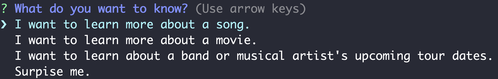

# LIRI
LIRI (_Language_ Interpretation and Recognition Interface) is a CLI Node.js app that searches Spotify for songs, Bands in Town for concerts, and OMDB for movies using an easy-to-use Inquirer interface.

# Install

Clone the repository to your machine. Download and install the dependencies.

`npm install`

Create a .env file to store your API keys for Spotify, OMDB, and Bands in Town. Format the file as such:

```
SPOTIFY_ID=your id here
SPOTIFY_SECRET=your secret here
OMDB_ID=your key here
BANDSINTOWN_ID=your key here
```

# Usage

Navigate to the repository. In the command line, start the application. 

`node liri.js`

Using the arrow as your cursor, select one of the options to begin searching Spotify for songs, Bands in Town for concerts, or OMDB for movies.


Type in a response to the prompt (see _How to Enter Commands_ for details on specifics) to get a response.


Based on your choice, you will receive some data about a song, movie, or band you're interested in. If run successfully, the output will be logged to the `log.txt` file (and create the file if it doesn't exist yet).


## How to Enter Commands
- I want to learn more about a song.
    - Searches Spotify by track/song name. Enter the name of a song, not an artist, to get a good result.

- I want to learn more about a movie.
    - Searches OMDB by movie name. Enter the name of a movie to get a good result.

- I want to learn about a band or musical artist's upcoming tour dates.
    - Searches Bands in Town by artist or band. Enter the name of an artist or band to get a good result.

- Surprise Me.
    - Randomly pulls a command from the `random.txt` file. If you want to add a random item to the list, enter it in the pattern of 
    
    `spotify|omdb|bandsintown, song|movie|artist`
    
    As in 
    
    `omdb, the indian in the cupboard`

# Specs

## Core

- JavaScript
- Node.js

## Packages
- Axios
- Dotenv
- Inquirer
- Moment
- Node Spotify API

# Contribute

This was built by Kenny Whitebloom (github.com/calemonte) as part of a coding class, but if you are interested in contributing, feel free to open a pull request from a new branch.
